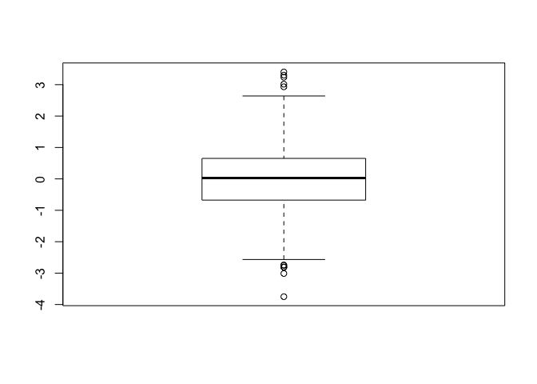
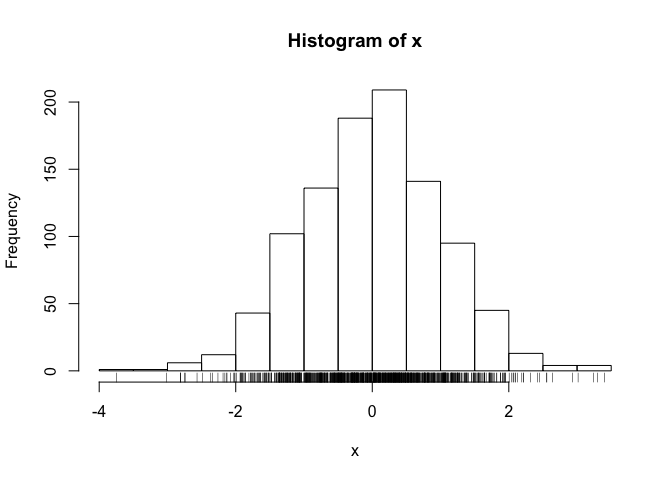
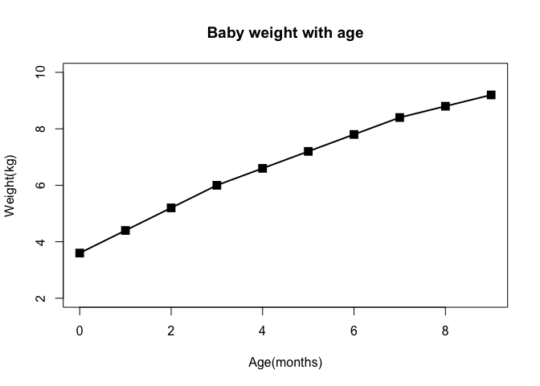
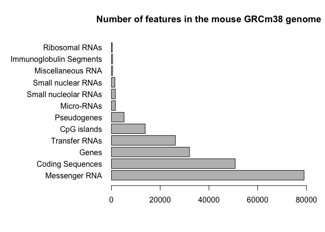
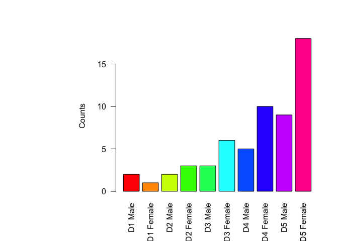
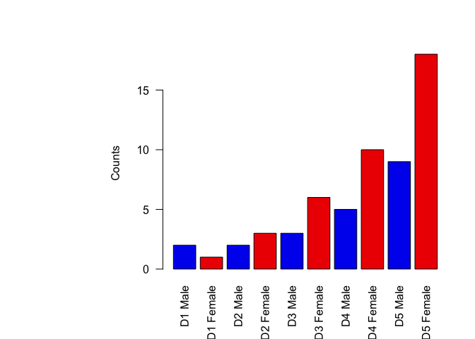
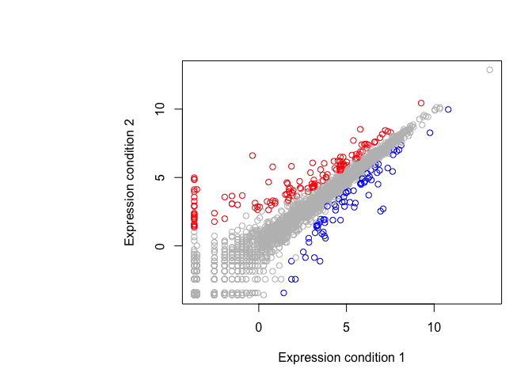

Class05: Data exploration and visualization in R
================
Cassandra Wang
2019-10-31

``` r
# Class5 Data Visualization
x <- rnorm(1000)

# some summary stats 
mean(x)
```

    ## [1] 0.0006484923

``` r
sd(x)
```

    ## [1] 1.000712

``` r
summary(x)
```

    ##      Min.   1st Qu.    Median      Mean   3rd Qu.      Max. 
    ## -3.750056 -0.674756  0.027380  0.000648  0.650814  3.404194

``` r
boxplot(x)
```

<!-- -->

``` r
hist(x)
rug(x)
```

<!-- -->

``` r
# Section 2 Customizing plots

# reading input file
weight <- read.table("bimm143_05_rstats/weight_chart.txt", header = TRUE)

# line plot
plot(weight$Age, weight$Weight, type = "o", pch = 15, cex = 1.5, lwd = 2, ylim = c(2,10), xlab = "Age(months)", ylab = "Weight(kg)", main ="Baby weight with age")
```

<!-- -->

``` r
#reading input file
mouse <- read.delim("bimm143_05_rstats/feature_counts.txt")
names.arg <- mouse$Feature

#barplot
par(mar=c(5,12,4,2))
barplot(mouse$Count, horiz = TRUE,names.arg=mouse$Feature, main = "Number of features in the mouse GRCm38 genome", las = 1, xlim = c(0,80000)) 
```

<!-- -->

``` r
# Section 3 Using color
counts <- read.delim("bimm143_05_rstats/male_female_counts.txt")
names.arg <- counts$Sample

# rainbow barplot
barplot(counts$Count,names.arg=counts$Sample,col=rainbow(nrow(counts)),ylab="Counts", las=2)
```

<!-- -->

``` r
# color by male and female
barplot(counts$Count,names.arg=counts$Sample,col=c("blue2","red2"),ylab="Counts", las=2)
```

<!-- -->

``` r
# scatterplot
genes <- read.delim("bimm143_05_rstats/up_down_expression.txt")
nrow(genes)
```

    ## [1] 5196

``` r
# determining number between different conditions
table(genes$State)
```

    ## 
    ##       down unchanging         up 
    ##         72       4997        127

``` r
palette(c("blue","gray","red"))
plot(genes$Condition1, genes$Condition2, col=genes$State, xlab="Expression condition 1",ylab="Expression condition 2")
```

<!-- -->
