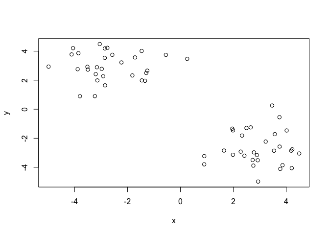
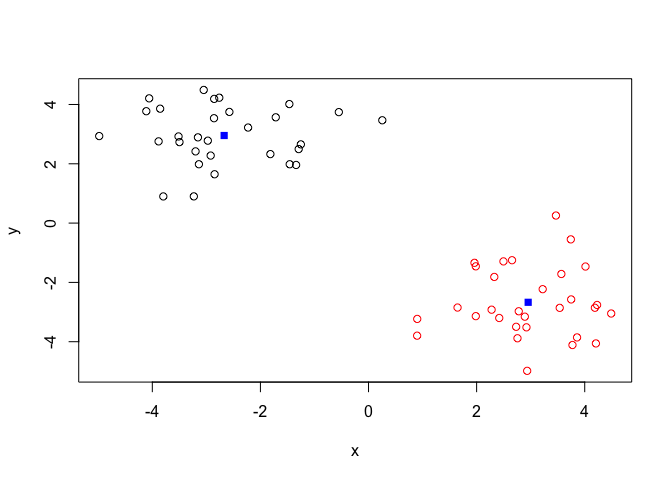
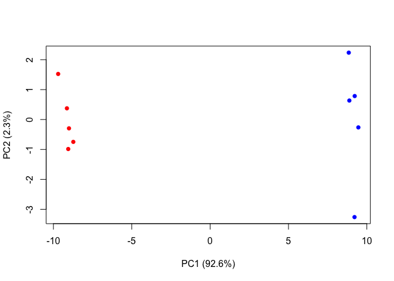

Class08
================
Cassandra Wang
10/24/2019

## K-means clustering

``` r
# Generate some sample data for clustering
tmp <- c(rnorm(30,-3), rnorm(30,3))
x <- cbind(x=tmp, y=rev(tmp))

plot(x)
```

<!-- -->

Use the kmeans() function setting k to 2 and nstart=20

``` r
k <- kmeans(x, centers=2, nstart=20)
```

``` r
k
```

    ## K-means clustering with 2 clusters of sizes 30, 30
    ## 
    ## Cluster means:
    ##          x        y
    ## 1 -2.67089  2.95369
    ## 2  2.95369 -2.67089
    ## 
    ## Clustering vector:
    ##  [1] 1 1 1 1 1 1 1 1 1 1 1 1 1 1 1 1 1 1 1 1 1 1 1 1 1 1 1 1 1 1 2 2 2 2 2
    ## [36] 2 2 2 2 2 2 2 2 2 2 2 2 2 2 2 2 2 2 2 2 2 2 2 2 2
    ## 
    ## Within cluster sum of squares by cluster:
    ## [1] 66.42629 66.42629
    ##  (between_SS / total_SS =  87.7 %)
    ## 
    ## Available components:
    ## 
    ## [1] "cluster"      "centers"      "totss"        "withinss"    
    ## [5] "tot.withinss" "betweenss"    "size"         "iter"        
    ## [9] "ifault"

For cluster size:

``` r
k$size 
```

    ## [1] 30 30

For cluster
    membership/assignment:

``` r
k$cluster
```

    ##  [1] 1 1 1 1 1 1 1 1 1 1 1 1 1 1 1 1 1 1 1 1 1 1 1 1 1 1 1 1 1 1 2 2 2 2 2
    ## [36] 2 2 2 2 2 2 2 2 2 2 2 2 2 2 2 2 2 2 2 2 2 2 2 2 2

For cluster center:

``` r
k$centers
```

    ##          x        y
    ## 1 -2.67089  2.95369
    ## 2  2.95369 -2.67089

Plot x colored by the kmeans cluster assignment and add cluster centers
as blue points

``` r
plot(x, col=k$cluster)
points(k$centers, col="blue", pch=15)
```

<!-- -->

## Hierarchical clustering

The `hclust()` function requires a distance matrix as an input. You can
get this from the `dist()`
function.

``` r
# First we need to calculate point (dis)similarity as the Euclidean distance between observations
dist_matrix <- dist(x)

# The hclust() function returns a hierarchical clustering model
hc <- hclust(d = dist_matrix)

# The print method is not so useful here
hc
```

    ## 
    ## Call:
    ## hclust(d = dist_matrix)
    ## 
    ## Cluster method   : complete 
    ## Distance         : euclidean 
    ## Number of objects: 60

``` r
# Draw a dendrogram
plot(hc)
abline(h=6, col="red")
```

<!-- -->

``` r
grps <- cutree(hc, h=6)
```

``` r
cutree(hc, k=4)
```

    ##  [1] 1 2 1 1 1 2 2 1 2 2 2 2 2 2 1 1 1 2 1 2 1 2 1 2 2 1 2 2 2 2 3 3 3 3 4
    ## [36] 3 3 4 3 4 3 4 3 4 4 4 3 3 3 3 3 3 4 3 3 4 4 4 3 4

``` r
# Step 1. Generate some example data for clustering
x2 <- rbind(
 matrix(rnorm(100, mean=0, sd = 0.3), ncol = 2), # c1
 matrix(rnorm(100, mean = 1, sd = 0.3), ncol = 2), # c2
 matrix(c(rnorm(50, mean = 1, sd = 0.3), # c3
 rnorm(50, mean = 0, sd = 0.3)), ncol = 2))
colnames(x2) <- c("x", "y")

# Step 2. Plot the data without clustering
plot(x2)
```

<!-- -->

``` r
# Step 3. Generate colors for known clusters (just so we can compare to hclust results)
col <- as.factor( rep(c("c1","c2","c3"), each=50) )
plot(x2, col=col)
```

<!-- -->

``` r
# clustering 
hc2 <- hclust(dist(x2))

# draw tree
plot(hc2)
abline(h=2, col="red")
```

<!-- -->

``` r
# cut the tree into clusters/groups 
grps2 <- cutree(hc2, k=3)
grps2
```

    ##   [1] 1 2 2 2 2 2 2 2 2 2 2 2 2 2 2 2 2 2 2 2 2 2 2 2 2 2 2 2 2 2 2 2 2 1 2
    ##  [36] 2 2 2 2 2 2 2 2 2 2 2 2 2 2 2 1 1 1 1 1 1 1 1 1 1 1 1 1 1 1 1 1 1 1 1
    ##  [71] 1 1 1 1 1 1 1 1 1 1 1 1 1 1 1 1 1 1 1 1 1 1 1 1 1 1 1 1 1 1 3 3 3 3 3
    ## [106] 3 1 3 1 1 3 3 3 1 1 1 3 1 3 3 3 3 1 3 1 3 1 3 1 1 3 1 3 3 1 1 3 3 1 3
    ## [141] 3 3 3 3 2 1 3 3 3 1

Plot the data colored by their hclust result with k=3.

``` r
plot(x2, col=grps2)
```

<!-- -->

How many points in each cluster?

``` r
table(grps2)
```

    ## grps2
    ##  1  2  3 
    ## 70 49 31

Cross-tabulate (i.e. compare our clustering result with the known
answer)

``` r
table(grps2, col)
```

    ##      col
    ## grps2 c1 c2 c3
    ##     1  2 50 18
    ##     2 48  0  1
    ##     3  0  0 31

## Principal Component Analysis (PCA)

Read some example gene expression data:

``` r
mydata <- read.csv("https://tinyurl.com/expression-CSV",
 row.names=1)

head(mydata)
```

    ##        wt1 wt2  wt3  wt4 wt5 ko1 ko2 ko3 ko4 ko5
    ## gene1  439 458  408  429 420  90  88  86  90  93
    ## gene2  219 200  204  210 187 427 423 434 433 426
    ## gene3 1006 989 1030 1017 973 252 237 238 226 210
    ## gene4  783 792  829  856 760 849 856 835 885 894
    ## gene5  181 249  204  244 225 277 305 272 270 279
    ## gene6  460 502  491  491 493 612 594 577 618 638

How many genes are is this dataset?

``` r
dim(mydata)
```

    ## [1] 100  10

``` r
nrow(mydata)
```

    ## [1] 100

Let’s do pca with the pr(comp) function.

``` r
pca <- prcomp(t(mydata), scale=TRUE)

## See what is returned by the prcomp() function
attributes(pca)
```

    ## $names
    ## [1] "sdev"     "rotation" "center"   "scale"    "x"       
    ## 
    ## $class
    ## [1] "prcomp"

``` r
# $names
#[1] "sdev" "rotation" "center" "scale" "x"
#
# $class
#[1] "prcomp"

## A basic PC1 vs PC2 2-D plot
plot(pca$x[,1], pca$x[,2])
```

<!-- -->

``` r
## Variance captured per PC
pca.var <- pca$sdev^2 

## Precent variance is often more informative to look at
pca.var <- pca$sdev^2
pca.var.per <- round(pca.var/sum(pca.var)*100, 1)

pca.var.per
```

    ##  [1] 92.6  2.3  1.1  1.1  0.8  0.7  0.6  0.4  0.4  0.0

``` r
barplot(pca.var.per, main="Scree Plot",
 xlab="Principal Component", ylab="Percent Variation")
```

<!-- -->

``` r
## A vector of colors for wt and ko samples
colvec <- colnames(mydata)
colvec[grep("wt", colvec)] <- "red"
colvec[grep("ko", colvec)] <- "blue"
plot(pca$x[,1], pca$x[,2], col=colvec, pch=16,
 xlab=paste0("PC1 (", pca.var.per[1], "%)"),
 ylab=paste0("PC2 (", pca.var.per[2], "%)")) 
```

<!-- -->

## PCA of UK Food Data

``` r
x <- read.csv("UK_foods.csv")
dim(x)
```

    ## [1] 17  5

Preview first and last 6 rows of the dataset.

``` r
head(x)
```

    ##                X England Wales Scotland N.Ireland
    ## 1         Cheese     105   103      103        66
    ## 2  Carcass_meat      245   227      242       267
    ## 3    Other_meat      685   803      750       586
    ## 4           Fish     147   160      122        93
    ## 5 Fats_and_oils      193   235      184       209
    ## 6         Sugars     156   175      147       139

``` r
tail(x)
```

    ##                    X England Wales Scotland N.Ireland
    ## 12      Fresh_fruit     1102  1137      957       674
    ## 13          Cereals     1472  1582     1462      1494
    ## 14         Beverages      57    73       53        47
    ## 15      Soft_drinks     1374  1256     1572      1506
    ## 16 Alcoholic_drinks      375   475      458       135
    ## 17    Confectionery       54    64       62        41

``` r
rownames(x) <- x[,1]
x <- x[,-1]
head(x)
```

    ##                England Wales Scotland N.Ireland
    ## Cheese             105   103      103        66
    ## Carcass_meat       245   227      242       267
    ## Other_meat         685   803      750       586
    ## Fish               147   160      122        93
    ## Fats_and_oils      193   235      184       209
    ## Sugars             156   175      147       139

``` r
dim(x)
```

    ## [1] 17  4

``` r
x <- read.csv("UK_foods.csv", row.names=1)
head(x)
```

    ##                England Wales Scotland N.Ireland
    ## Cheese             105   103      103        66
    ## Carcass_meat       245   227      242       267
    ## Other_meat         685   803      750       586
    ## Fish               147   160      122        93
    ## Fats_and_oils      193   235      184       209
    ## Sugars             156   175      147       139

Generating barplots and pairwise plots

``` r
barplot(as.matrix(x), beside=T, col=rainbow(nrow(x)))
```

<!-- -->

``` r
barplot(as.matrix(x), beside=F, col=rainbow(nrow(x)))
```

<!-- -->

``` r
pairs(x, col=rainbow(10), pch=16)
```

<!-- -->

# Use the prcomp() PCA function

``` r
pca <- prcomp( t(x) )
summary(pca)
```

    ## Importance of components:
    ##                             PC1      PC2      PC3       PC4
    ## Standard deviation     324.1502 212.7478 73.87622 4.189e-14
    ## Proportion of Variance   0.6744   0.2905  0.03503 0.000e+00
    ## Cumulative Proportion    0.6744   0.9650  1.00000 1.000e+00

``` r
# Plot PC1 vs PC2
plot(pca$x[,1], pca$x[,2], xlab="PC1", ylab="PC2", xlim=c(-270,500))
text(pca$x[,1], pca$x[,2], colnames(x))
```

<!-- -->

``` r
plot(pca$x[,1], pca$x[,2])
```

<!-- -->
